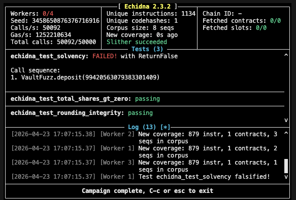

-- Finding 1: Invariant Violation in Solvency Check

Description: Echidna identified that totalAssets could deviate from address(this).balance.

Root Cause: Input parameter amount was decoupled from msg.value.

Fix: Refactored deposit to rely solely on msg.value for state updates.

